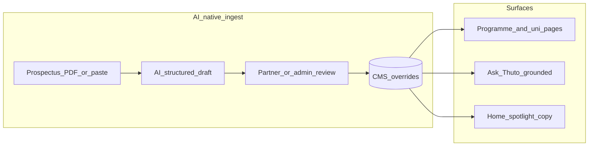

# Thuto — AI-native CMS strategy

Product direction: Thuto should be **AI-native software**, not merely **AI-powered**. The CMS is the advantage.

This document is strategy and sequencing only — no implementation in this revision.

---

## AI-powered vs AI-native (for Thuto)

| | **AI-powered** (today’s shape) | **AI-native** (target) |
|--|-------------------------------|------------------------|
| Role of AI | Feature bolted on (chat, moderation) | Default way content enters, stays fresh, and answers students |
| System of record | Humans edit forms; AI talks *about* data | CMS structured data is what AI **reads and writes**; chat is a view |
| Partner value | Self-serve forms + analytics | Prospectus → structured profile in minutes; accuracy becomes a loop |
| Student value | “Ask Thuto” + local heuristics | Answers grounded in published catalogue; citations to programme pages |
| Moat | Harder to copy a chatbot | Harder to copy **localised African HE content + partner write-path + grounded answers** |

**One-line test:** If we removed the Ask Thuto button, would AI still be doing critical work in the product? Today: mostly no. Target: yes — in ingest, draft, review, and grounded Q&A.

---

## Why the CMS is the advantage

Thuto already has what generic “AI education apps” lack:

1. **Structured HE catalogue** — programmes, points, subject requirements, modules, careers, application windows (`public/data/*.json` + live overrides).
2. **Live overlay CMS** — Supabase `content_*_overrides`, page sections, `content-assets`, merge at runtime (`contentManagement.js`, `usePageContent`).
3. **Partner write-path** — `/partner` for institution-scoped edits + analytics (B2B package in [THUTO_REVENUE_MODEL_PLAN.md](./THUTO_REVENUE_MODEL_PLAN.md)).
4. **Ops write-path** — `/admin` catalogue + page content for Thuto staff.
5. **Existing Gemini edge path** — `assistant`, `feed-moderation`, unused `home-spotlight` — keys stay server-side.
6. **Localisation moat** — country-by-country exam systems and catalogues ([CONTEXT.md](../CONTEXT.md)); AI that only chats cannot own that.

Competitors can ship a chatbot overnight. They cannot overnight own **verified partner-edited, AI-assisted, locally correct catalogue data** that both powers discovery and grounds answers.

---

## Current state (baseline)

| Layer | Status |
|-------|--------|
| Partner CMS (`/partner`) | Shipped: profile, programmes, staff, resources, leads, analytics |
| Admin CMS (`/admin`) | Shipped: catalogue overrides, page content JSON editor, opportunities |
| Page copy | Defaults in `pageContentDefaults.js` + `content_page_sections` |
| Ask Thuto | Hybrid: local heuristics + optional Gemini with compact context from catalogue |
| Feed AI | Gemini moderation only |
| Home spotlight Gemini | Edge function exists; UI uses partner ad carousels instead |
| AI inside CMS editors | **None** — no draft/rewrite/extract in Admin or Partner |

Bulk catalogue still largely comes from merge scripts under `scripts/` and PDFs in `docs/`. CMS is for live corrections and partner self-serve — the right substrate to make AI-native.

---

## Principles (non-negotiable)

1. **Human approve before publish** — AI drafts; partners/admins publish. Never auto-overwrite live catalogue without review.
2. **Offline / defaults first** — Bundled JSON + page defaults keep working when Supabase or Gemini is down (PWA).
3. **Guidance, not authority** — AI copy and answers must reinforce that Thuto is guidance; min points/deadlines need source verification.
4. **Keys server-side** — All generative calls via Supabase Edge Functions (same pattern as `assistant`).
5. **Institution scope** — Partner AI only sees/writes that institution’s rows (existing RLS).
6. **Cite the CMS** — Student answers should link to `/programmes/:id` / `/universities/:id` from grounded records, not invent fees or cut-offs.
7. **Localisation-aware prompts** — Botswana BGCSE/points first; country packs later — do not genericise into global edtech copy.
8. **No fragile bootstrap refactors** — Implement AI CMS features in pages/libs/edge functions; do not touch `main.jsx` / routing unless a route is explicitly required.

---

## Sequencing: all three surfaces

Order is a **flywheel**, not equal priority at once:

1. **Partner CMS** — improves data quality and B2B value (revenue + accuracy).
2. **Admin CMS** — scales Thuto ops and marketing without redeploys.
3. **Student grounding** — Ask Thuto (and related surfaces) become trustworthy because (1)+(2) filled the CMS.

Skipping straight to a smarter chatbot without (1) recreates “AI-powered” theater on thin data.

---

## Phase A — Partner CMS (first wedge)

**Job:** Universities manage programmes the AI-native way: upload or paste → structured draft → edit → publish.

### Capabilities

| Capability | Description |
|------------|-------------|
| **Prospectus ingest** | Upload PDF (existing `content-assets` bucket) or paste text → Edge Function extracts candidate programme fields into the same patch shape partners already save |
| **Field fill assist** | Per-field “Draft with AI” for description, careers, modules summary, requirements narrative (never silent overwrite) |
| **Diff review** | Side-by-side: current published vs AI draft; partner accepts field-by-field |
| **Freshness prompts** | Soft nudges when application windows look stale vs today (suggest update; human confirms) |
| **Staff / resources assist** | Draft `staff[]` / `resources[]` entries from pasted org-chart or prospectus sections |

### Product framing (partner)

- Pitch: “Update your Thuto profile from your prospectus in one sitting — not a week of form filling.”
- Fits verified / Insights / Growth tiers as a clear upgrade over static listings (StudyPortals-style dashboards already ship analytics; AI CMS is the content half).

### Technical sketch (later implementation)

- New Edge Function e.g. `content-assist` (Gemini), actions: `extract_programmes`, `draft_field`, `suggest_resources`.
- Input: text or storage path + `institution_id`; output: JSON patch compatible with `content_programme_overrides` / university patch.
- UI: `/partner` programme editor toolbar only; reuse `partner.js` save/merge.

### Success metrics

- Time-to-first-published programme edit for a new partner
- % of partner saves that started from an AI draft
- Reduction in empty description / careers / modules fields for verified partners
- Partner retention / tier upgrade attributed to CMS assist (qualitative + support tickets)

---

## Phase B — Admin CMS (ops + marketing)

**Job:** Thuto staff use AI inside the existing Admin editors so catalogue corrections and page copy stay fast as countries expand.

### Capabilities

| Capability | Description |
|------------|-------------|
| **Catalogue extract** | Same ingest as partners, but cross-institution; feed merge-script workflow with AI drafts that still land as overrides or script-ready JSON |
| **Page copy assist** | In “Page content” editor: rewrite / shorten / localise tone for hero, CTAs, legal-adjacent marketing (respect brand voice in `DESIGN.md`) |
| **Bulk consistency** | Flag programmes missing `minPoints`, subject keys, or apply URLs; suggest fills from prospectus text already uploaded |
| **Spotlight copy** | Wire or replace unused `home-spotlight` so featured blurbs are generated from **published CMS fields**, then human-edited |

### Technical sketch

- Extend `content-assist` with admin-only actions; gate on `feed_admins`.
- Admin UI: actions beside `StructuredContentFields` and catalogue forms — not a separate “AI app.”
- Keep `PAGE_CONTENT_DEFAULTS` as fallback; AI only proposes live section patches.

### Success metrics

- Admin hours per institution onboarded
- Page content updates shipped without engineer redeploy
- Spotlight/home copy freshness (days since last edit)

---

## Phase C — Student experience grounded in CMS

**Job:** Ask Thuto (and related AI surfaces) become a **read path over the CMS**, not a general chatbot with a thin context window.

### Capabilities

| Capability | Description |
|------------|-------------|
| **Grounded answers** | Gemini context built only from published merged catalogue (+ predictor snapshot); refuse or hedge when CMS has no row |
| **Citations** | Every factual claim about a programme links to in-app detail pages |
| **Local-first parity** | Improve `buildLocalAssistantReply` to use the same merged data path partners just enriched (offline still useful) |
| **Entitlements unchanged** | Free 3 AI/day, Pro unlimited — grounding increases quality, not necessarily free quota |
| **Optional later** | “Why this match?” explanations that quote CMS requirement fields; country-pack prompts when localisation expands |

### Technical sketch

- Evolve `buildGeminiAssistantContext` / Edge Function prompts: stricter “only use provided JSON,” structured citations.
- Prefer merged `fetchProgrammes` / `fetchUniversities` output (overrides included) as the only factual corpus.
- Do not train or imply affiliation; keep disclaimer language in system prompt.

### Success metrics

- % of AI answers with at least one valid in-app citation
- Support / trust incidents (“AI invented a fee”) trending down
- Ask → programme detail click-through
- Free→Pro conversion on AI limit still measured via existing analytics

---

## What we will not do (in this strategy)

- Replace the partner/admin forms with a chat-only CMS.
- Auto-publish AI output to students.
- Put provider API keys in Vite.
- Position the landing page as “ChatGPT for university” — brand remains local HE guidance; AI is infrastructure.
- Scope Phase C features that need vector DBs before Phase A proves ingest quality (start with compact structured context; add retrieval only if catalogue size demands it).

---

## Suggested delivery slices (when implementation starts)

Ordered backlog for future PRs (not this doc PR):

1. `content-assist` Edge Function + partner “Draft from paste” for one programme
2. Partner field-level accept/reject UI
3. PDF upload → extract (reuse `content-assets`)
4. Admin page-copy rewrite action
5. Ask Thuto prompt + context hardening + citations
6. Spotlight blurbs from CMS fields
7. Country-pack prompt templates (post-Botswana expansion)

---

## Relationship to other plans

| Doc | Relationship |
|-----|----------------|
| [THUTO_REVENUE_MODEL_PLAN.md](./THUTO_REVENUE_MODEL_PLAN.md) | Phase A deepens B2B “self-service CMS”; analytics already sold — AI ingest is the next CMS differentiator |
| [POSTGRADUATE_MODULES_PLAN.md](./POSTGRADUATE_MODULES_PLAN.md) | Content overrides remain the correction path; AI assist accelerates PG module entry |
| [CONTEXT.md](../CONTEXT.md) | Product identity + localisation; this strategy is how AI serves that identity |
| `thuto_roadmap.md` | Launch/ops checklist; AI-native CMS is strategic backlog, not a launch blocker |

---

## Open product decisions (resolve before build)

1. **Tier gating:** Is prospectus ingest Verified-only, or Insights+ only?
2. **Draft retention:** Store AI drafts as `published: false` overrides vs ephemeral client state?
3. **Citation UX:** Inline chips vs footnote list in Ask Thuto?
4. **Model:** Stay on Gemini Flash for cost; escalate only for long PDF extract?

Defaults if unspecified at build time: Insights+ for heavy ingest; drafts as unpublished overrides; inline citation chips; Gemini Flash.

---

## North star

Thuto wins when a university updates a prospectus and students get **correct, local, citable** answers the same week — without Thuto engineering rewriting JSON by hand, and without pretending a chatbot alone is the product.
