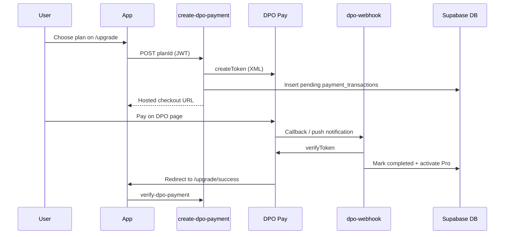

# DPO Pay and Thuto Pro setup

Use this checklist when connecting **DPO Pay by Network** for Thuto Pro in Botswana.

## 1. Create a DPO merchant account

1. Visit [DPO Pay Botswana](https://dpogroup.com/online-payments/botswana/) and apply for a merchant account.
2. Complete KYC with your CIPA business documents and settlement bank account.
3. Ask your DPO account manager for:
   - **Company Token** (`DPO_COMPANY_TOKEN`)
   - **Service Type** (`DPO_SERVICE_TYPE`) for your product category
4. Confirm **BWP** is enabled for your account.

## 2. Supabase

1. Apply migrations including:
   - `supabase/migrations/20260522000000_profiles_and_premium.sql`
   - `supabase/migrations/20260703120000_payment_transactions.sql`
   - `supabase/migrations/20260703143000_dpo_payment_columns.sql` (if upgrading from an earlier draft)
2. Deploy edge functions:
   ```bash
   supabase functions deploy create-dpo-payment
   supabase functions deploy verify-dpo-payment
   supabase functions deploy dpo-webhook --no-verify-jwt
   ```
3. Set secrets:
   ```bash
   supabase secrets set DPO_COMPANY_TOKEN=your-company-token
   supabase secrets set DPO_SERVICE_TYPE=your-service-type
   supabase secrets set DPO_AMOUNT_YEARLY=59
   supabase secrets set DPO_AMOUNT_FIVE_YEAR=199
   supabase secrets set DPO_CURRENCY=BWP
   supabase secrets set SITE_URL=https://dondie52.github.io/thuto
   ```

`SITE_URL` must match your deployed app origin (no trailing slash).

## 3. DPO dashboard configuration

1. **Push payments callback** (optional but recommended):  
   `https://cytqacoqyqqijwsdcrpt.supabase.co/functions/v1/dpo-webhook`
2. Ensure your account allows hosted checkout (`createToken` + `payv2.php`).
3. Use DPO test credentials first, then switch to live after approval.

## 4. End-to-end test

1. Sign in on Thuto → open `/upgrade`.
2. Choose **Yearly Pro (P59)** or **5-Year Pro (P199)**.
3. Complete payment on the DPO hosted page.
4. You should land on `/upgrade/success?provider=dpo&company_ref=...&TransactionToken=...`.
5. Confirm Pro is active on `/profile`.
6. Check `payment_transactions.status = completed`.

## 5. How it works



## 6. Troubleshooting

| Issue | Fix |
|-------|-----|
| `DPO_COMPANY_TOKEN is not set` | Add secret and redeploy functions |
| `DPO_SERVICE_TYPE is not set` | Ask DPO for your service type code |
| Invalid Company Token (802) | Check test vs live token matches environment |
| Pro not activating | Check function logs; confirm `verifyToken` returns `000` |
| Currency error | Set `DPO_CURRENCY=BWP` or ask DPO which currencies are enabled |
| Legacy Stripe portal missing | Only users with `payment_provider = stripe` see portal |

## 7. Plans and amounts

| Plan | Default amount | Env override |
|------|----------------|--------------|
| Yearly Pro | P59 | `DPO_AMOUNT_YEARLY` |
| 5-Year Pro | P199 | `DPO_AMOUNT_FIVE_YEAR` |

## Legacy Stripe (optional)

Existing Stripe subscribers can still use the customer portal. See [STRIPE_SETUP.md](./STRIPE_SETUP.md).
