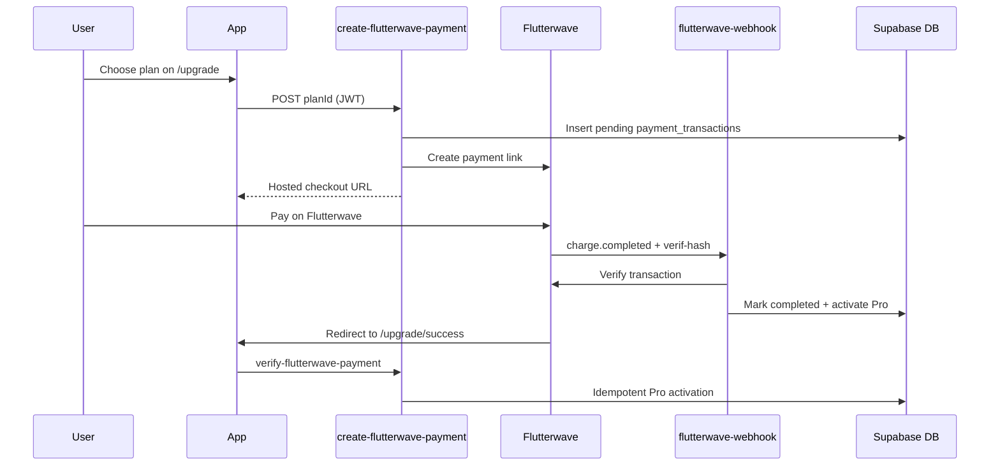

# Flutterwave and Thuto Pro setup

Use this checklist when connecting **Flutterwave** payments for Thuto Pro (Botswana-friendly alternative to Stripe).

## 1. Flutterwave Dashboard

1. Create a [Flutterwave](https://flutterwave.com) merchant account (Botswana supported).
2. Copy your **Secret Key** (test first, then live):
   - Test: Dashboard → Settings → API Keys → Secret Key
3. Create a **Webhook**:
   - URL: `https://<project-ref>.supabase.co/functions/v1/flutterwave-webhook`
   - Copy the **Secret hash** (verif-hash) → `FLUTTERWAVE_WEBHOOK_SECRET`
4. Confirm supported **currency** for your account (try `BWP`; fallback to `USD` if needed).

## 2. Supabase

1. Apply migrations including:
   - `supabase/migrations/20260522000000_profiles_and_premium.sql`
   - `supabase/migrations/20260703120000_flutterwave_payment_transactions.sql`
2. Deploy edge functions:
   ```bash
   supabase functions deploy create-flutterwave-payment
   supabase functions deploy verify-flutterwave-payment
   supabase functions deploy flutterwave-webhook --no-verify-jwt
   ```
3. Set secrets:
   ```bash
   supabase secrets set FLUTTERWAVE_SECRET_KEY=FLWSECK_TEST-...
   supabase secrets set FLUTTERWAVE_WEBHOOK_SECRET=your-webhook-secret-hash
   supabase secrets set FLUTTERWAVE_AMOUNT_YEARLY=59
   supabase secrets set FLUTTERWAVE_AMOUNT_FIVE_YEAR=199
   supabase secrets set FLUTTERWAVE_CURRENCY=BWP
   supabase secrets set SITE_URL=https://dondie52.github.io/thuto
   ```

`SITE_URL` must match your deployed app origin (no trailing slash).

### Legacy Stripe (optional)

Existing Stripe subscribers can still use the customer portal. Keep these secrets if you have legacy users:

```bash
supabase functions deploy create-checkout-session
supabase functions deploy create-portal-session
supabase functions deploy stripe-webhook --no-verify-jwt
```

See [STRIPE_SETUP.md](./STRIPE_SETUP.md) for Stripe-specific configuration.

## 3. GitHub Actions / local `.env`

| Variable | Where |
|----------|--------|
| `VITE_SUPABASE_URL` | GitHub secret + `.env` |
| `VITE_SUPABASE_ANON_KEY` | GitHub secret + `.env` |

Checkout runs entirely on Flutterwave hosted pages — no publishable key is required in the frontend.

## 4. End-to-end test (test mode)

1. Sign up on `/auth`.
2. Open `/upgrade` → choose **Yearly Pro (P59)** or **5-Year Pro (P199)**.
3. Complete payment on Flutterwave (use test cards from Flutterwave docs).
4. Land on `/upgrade/success?provider=flutterwave&tx_ref=...&transaction_id=...&status=successful`.
5. Confirm Pro activates on `/profile` (`premium_status = active`).
6. Check `payment_transactions` row status is `completed`.

## 5. How it works



## 6. Troubleshooting

| Issue | Fix |
|-------|-----|
| "FLUTTERWAVE_SECRET_KEY is not set" | Add secret via `supabase secrets set` and redeploy functions |
| Webhook 401 Invalid signature | Match `FLUTTERWAVE_WEBHOOK_SECRET` to Dashboard webhook secret hash |
| Currency not supported | Set `FLUTTERWAVE_CURRENCY=USD` and adjust amounts |
| Pro not activating | Check function logs; confirm webhook URL and `payment_transactions` row |
| Legacy Stripe portal missing | Only users with `payment_provider = stripe` and `stripe_customer_id` see portal |

## 7. Plans and amounts

| Plan | Default amount | Env override |
|------|----------------|--------------|
| Yearly Pro | P59 | `FLUTTERWAVE_AMOUNT_YEARLY` |
| 5-Year Pro | P199 | `FLUTTERWAVE_AMOUNT_FIVE_YEAR` |

Amounts must match what you configure in Flutterwave and what the app displays on `/upgrade`.
